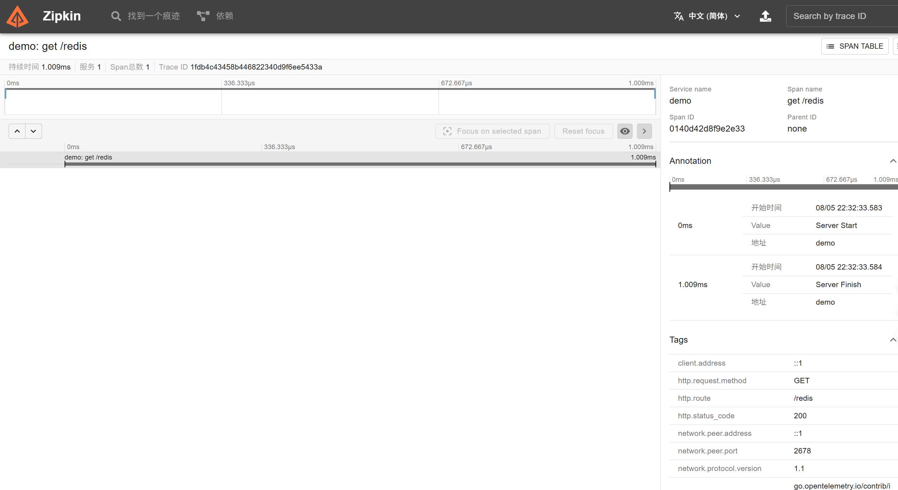

[root]# vi Dockerfile
[root]# # 构建镜像
[root]# docker build -t my-zipkin .
[root]# docker run -d -p 9411:9411 --name zipkin-service my-zipkin

[root]# vi redisDockerfile
[root]# docker build -t my-redis -f redisDockerfile .
[root]# docker run -d --name redis -p 6379:6379 my-redis

[root]# cat Dockerfile
# 使用官方 Zipkin 精简版镜像作为基础
FROM openzipkin/zipkin-slim:2.24

# 暴露 Zipkin 默认端口
EXPOSE 9411

# 使用镜像默认的启动命令
CMD ["java", "-jar", "/app/zipkin.jar"]
[root]# cat redisDockerfile
FROM redis:7.0-alpine

# 暴露Redis端口
EXPOSE 6379

# 使用默认配置启动Redis
CMD ["redis-server"]

curl and view Zipkin
